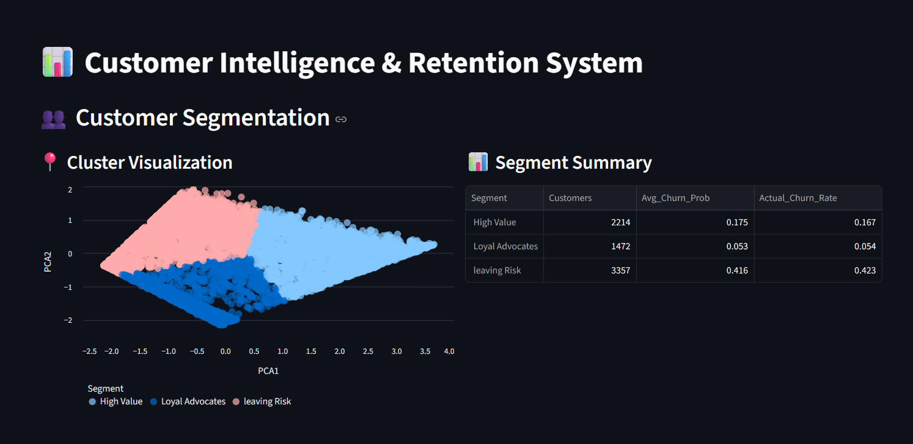
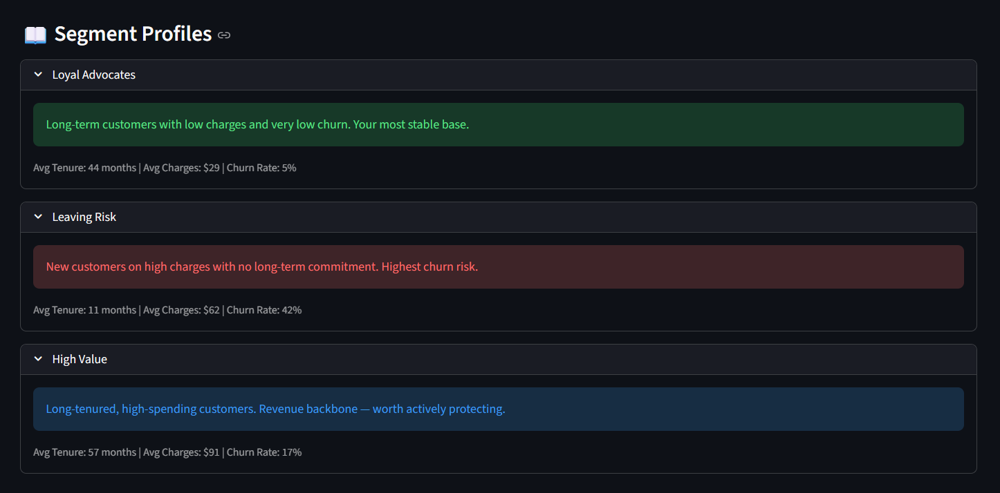
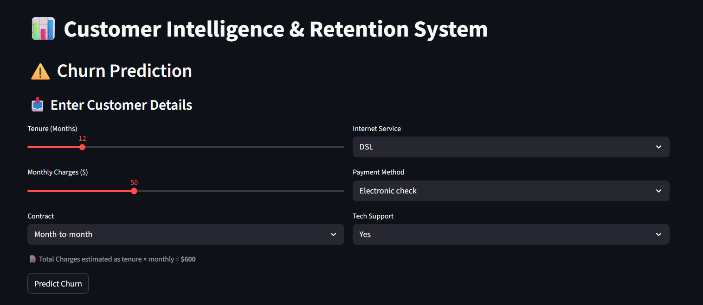
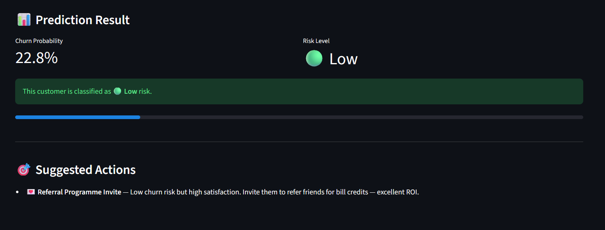
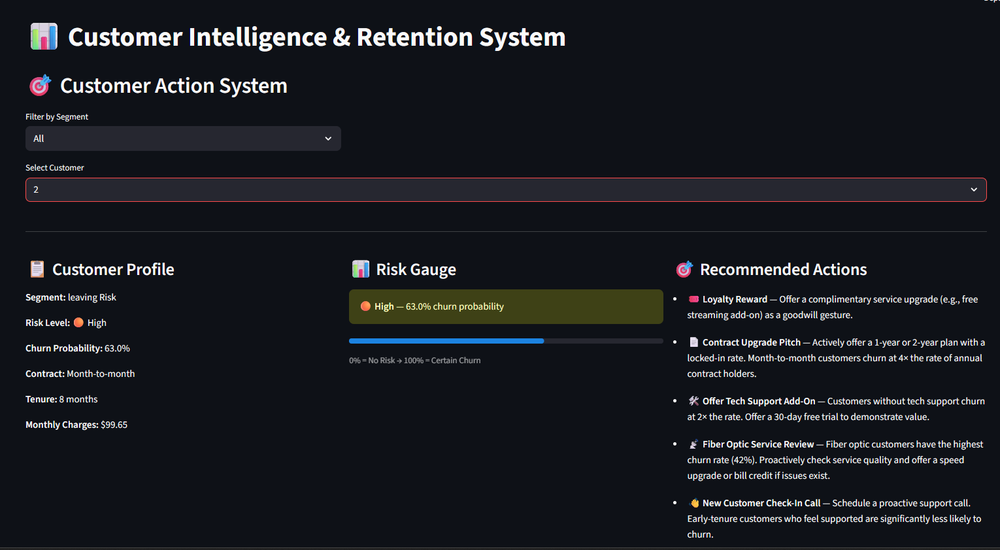

# ChurnLens — Production ML Platform for Customer Churn Prediction

> End-to-end machine learning system for telecom customer churn prediction with business-first optimization, PCA-based customer segmentation, and an interactive retention dashboard.


---

## What this project does

Most churn models stop at accuracy. ChurnLens goes further — it frames churn as a **business cost problem**, not a classification problem.

- Decision threshold tuned from 0.50 → 0.40, increasing recall on churners from 50% to 67%
- Customers segmented into 3 actionable groups using KMeans + PCA
- Per-customer retention actions generated based on contract type, tenure, internet service, and risk level
- Full interactive dashboard for business teams — no SQL or code required

---

## Live Demo

> **https://customer-churn123.streamlit.app/**

---

## Screenshots

| Dashboard | 
|-----------|
|  |

| Segmentation |
|-----------|
|  |
|  |

| Churn Prediction | 
|-----------------|
|  |
|  |

| Customer Actions |
|-----------------|
|  |

---

## Key Results

| Metric | Value |
|--------|-------|
| Best ROC-AUC (Logistic Regression) | 0.856 |
| Deployed Model ROC-AUC (XGBoost) | 0.835 |
| Churn Recall @ threshold 0.40 | 67% |
| Leaving Risk segment churn rate | 42.3% |
| Loyal Advocates segment churn rate | 5.4% |
| Total customers analyzed | 7,043 |
| Critical risk customers flagged | 700 |

> XGBoost selected for deployment over Logistic Regression despite marginally lower AUC — tree-based models capture non-linear feature interactions (contract × tenure × internet service) that are critical for generating meaningful per-feature retention logic. Logistic Regression's higher AUC comes from linear separability on this dataset, not deeper pattern recognition.

---

## Model Comparison

| Model | Accuracy | Precision | Recall | ROC-AUC |
|-------|----------|-----------|--------|---------|
| Logistic Regression | 0.809 | 0.654 | 0.591 | **0.856** |
| Random Forest | 0.797 | 0.649 | 0.512 | 0.840 |
| XGBoost *(deployed)* | 0.783 | 0.606 | 0.520 | 0.835 |
| KNN | 0.775 | 0.574 | 0.591 | 0.796 |
| Decision Tree | 0.744 | 0.518 | 0.512 | 0.671 |

---

## Customer Segments

| Segment | Customers | Avg Churn Prob | Actual Churn Rate |
|---------|-----------|---------------|-------------------|
| Leaving Risk | 3,357 | 41.6% | 42.3% |
| High Value | 2,214 | 17.5% | 16.7% |
| Loyal Advocates | 1,472 | 5.3% | 5.4% |

Segments derived using **KMeans clustering on scaled features**, visualized with **PCA (2 components)**. Cluster labels assigned based on average tenure, monthly charges, and churn probability.

---

## Features

**📊 Dashboard**
- Business KPIs: total customers, churn rate, avg monthly charges, critical risk count
- Segment and risk level distribution charts

**👥 Segmentation**
- PCA scatter plot of all 7,043 customers colored by segment
- Segment summary table with churn statistics
- Detailed segment profiles with business interpretation

**⚠️ Churn Prediction**
- Input any customer's details and get an instant churn probability
- Risk level classification: Critical / High / Medium / Low
- Suggested retention actions generated from prediction inputs

**🧠 Model Comparison**
- Full benchmark table of all 5 trained models
- Business justification for deployed model selection
- Threshold tuning explanation with cost-benefit reasoning

**🎯 Customer Action System**
- Filter customers by segment
- Per-customer risk profile with churn probability gauge
- Context-aware retention recommendations based on contract, tenure, internet service, and tech support status

---

## Tech Stack

| Layer | Tools |
|-------|-------|
| ML Models | XGBoost, LightGBM, Random Forest, Logistic Regression, KNN, Decision Tree |
| Preprocessing | Scikit-learn Pipeline, ColumnTransformer, StandardScaler |
| Segmentation | KMeans, PCA (scikit-learn) |
| Serialization | joblib (.pkl) |
| Frontend | Streamlit |
| Data | Pandas, NumPy |
| Visualization | Streamlit native charts |

---

## Project Structure

```
ChurnLens/
│
├── app.py                  # Streamlit application (5 pages)
├── customer_data.csv       # Processed dataset with segments + predictions
├── final_result_df.csv     # Model comparison results
├── churn_model.pkl         # Deployed XGBoost model
├── final_model.pkl         # Best performing model
├── preprocessor.pkl        # Fitted sklearn preprocessing pipeline
├── Customer_churn.ipynb    # Full training notebook
└── README.md
```

---

## How to Run Locally

```bash
# 1. Clone the repo
git clone https://github.com/YOUR_USERNAME/ChurnLens.git
cd ChurnLens

# 2. Install dependencies
pip install -r requirements.txt

# 3. Run the app
streamlit run app.py
```

**requirements.txt**
```
streamlit
pandas
numpy
scikit-learn
xgboost
joblib
```

---

## Business Framing

> In churn prediction, **a missed churner costs far more than a false alarm.**

Lowering the decision threshold from 0.50 to 0.40 means:
- The model flags more customers as at-risk
- Recall increases from 50% → 67% — catching 17% more churners
- Precision drops slightly — acceptable because retention outreach is low-cost
- Net effect: fewer high-value customers lost without intervention

This is the core insight that separates a business-ready model from a Kaggle notebook.

---

## Dataset

IBM Telco Customer Churn dataset — 7,043 customers, 21 features including contract type, tenure, monthly charges, internet service, and tech support status.

---

## Roadmap

- [ ] PyTorch ANN added to model benchmark
- [ ] SHAP explainability (TreeSHAP for per-customer feature attribution)
- [ ] Gemini-powered retention email generator
- [ ] Natural language Q&A chatbot over customer dataset
- [ ] FastAPI backend for production serving

---

